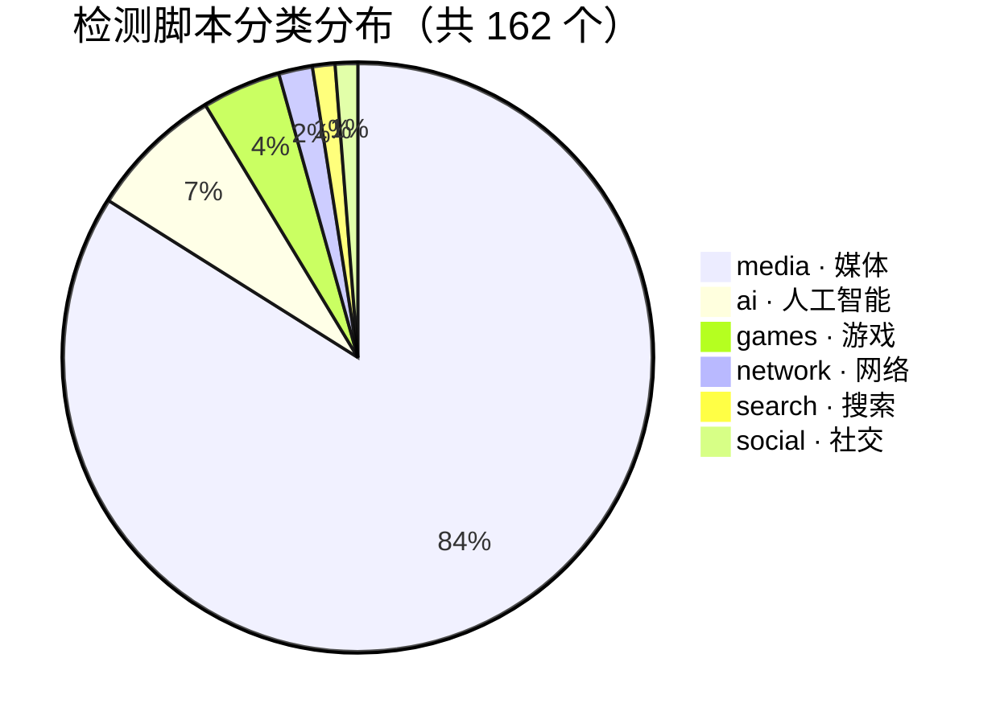

# miaospeed-scripts

为 [MiaoSpeed](https://github.com/AirportR/miaospeed) / [Koipy](https://koipy.gitbook.io/koipy) 测试机器人编写的**区域可用性与网络检测脚本集**，覆盖媒体、AI、游戏、网络诊断、搜索和社交平台，全部经过 Koipy 兼容性验证。

<p align="center">
  <a href="https://github.com/CloudPassenger/miaospeed-scripts/actions/workflows/build.yml"></a>
  
  
  <a href="https://koipy.gitbook.io/koipy"></a>
  <a href="https://github.com/AirportR/miaospeed"></a>
  
  
  <a href="./LICENSE"></a>
</p>

## 简介

订阅节点检测脚本通常散落为不同语言的独立实现，维护成本高、质量参差不齐。本项目基于 TypeScript 对主流开源检测方案进行统一重构：每个检测脚本是**独立入口、零运行时依赖**的单个文件，打包后直接在 goja（ES5/ES6）沙箱中运行，随 Koipy 测试机器人开箱即用。

## 特性

- 🚀 **即插即用**：下载 `scripts.zip` 解压即可，自动生成 `index.json` 索引与 `koipy-config.yaml` 配置
- 📦 **单文件脚本**：rollup 将每个脚本打包为单个 CJS 文件，无 npm 运行时依赖，goja 沙箱安全运行
- 🌍 **覆盖 6 大分类、25 个媒体市场**：162 个检测脚本，持续更新
- 🏷️ **标准元数据**：`@id` / `@category` / `@regions` / `@tags` 驱动索引与 Koipy 规则分组
- 🧩 **开箱即用的脚手架**：`pnpm run new` 交互式生成符合规范的新脚本
- ✅ **构建即校验**：`pnpm run build` 自动执行格式、lint、源码契约与类型检查，并提供 nightly 滚动发布

## 脚本一览



| 分类 | 脚本数 | 说明 |
|------|-------:|------|
| [media](./src/checks/media) | 136 | 流媒体与地区限定内容，按主要目标市场分目录 |
| [ai](./src/checks/ai) | 12 | ChatGPT、Claude、Gemini、DeepSeek 等 AI 服务 |
| [games](./src/checks/games) | 7 | Steam、Kancolle、Roblox 等游戏平台 |
| [network](./src/checks/network) | 3 | 回墙出口与 IP 质量检测 |
| [search](./src/checks/search) | 2 | Bing、Wikipedia |
| [social](./src/checks/social) | 2 | TikTok、Reddit |

媒体脚本覆盖 25 个目标市场：`us`(25) `jp`(21) `global`(14) `tw`(12) `au`(9) `kr`(9) `uk`(7) `eu`(6) `hk`(4) `de`(3) `fr`(3) `in`(3) `nl`(3) `nz`(3) `africa`(2) `ca`(2) `th`(2) `ch`(1) `cn`(1) `es`(1) `it`(1) `latam`(1) `ru`(1) `sg`(1) `vn`(1)

完整适配清单与计划见 [适配计划](./docs/projects.md)。

## 快速开始

1. 参考 [Koipy 文档](https://koipy.gitbook.io/koipy/kuai-su-kai-shi) 部署可用的测试机器人及 Miaospeed 后端
2. 下载最新 Release 中的 `scripts.zip`，解压至 Koipy 服务端的 `resources/scripts` 文件夹
3. 修改 [Koipy 配置](https://koipy.gitbook.io/koipy/pei-zhi-mu-ban) 启用所需检测脚本
4. 重启 Koipy 服务端，进行检测

> [!IMPORTANT]
> `scripts.zip`、`index.json` 和 `koipy-config.yaml` 应使用同一版本；从旧架构升级时需清理旧版目录与 `tools/`。详见 [使用指南](./docs/usage.md)。

## 开发

- 📖 [开发文档](./docs/development.md)：项目结构、脚本元数据规范、goja 运行时约定、构建与校验
- 📦 [使用指南](./docs/usage.md)：安装步骤、版本一致性、Release 资产说明
- 🗺️ [适配进度](./docs/projects.md)：完整脚本清单与适配计划

```bash
pnpm install   # 安装依赖（pnpm 是唯一包管理器）
pnpm run new   # 交互式脚手架生成新脚本
pnpm run check # 格式 + lint + 源码契约 + 类型检查
pnpm run build # 先执行 check，再打包全部脚本到 dist/
```

## 贡献

欢迎提交新脚本或改进现有脚本！开发流程：

1. Fork 并克隆仓库，运行 `pnpm install`
2. 执行 `pnpm run new` 按提示生成脚本骨架，或直接编写 `src/checks/` 下的脚本
3. 运行 `pnpm run check` 与 `pnpm run build` 通过全部校验
4. 提交 Pull Request

## 特别鸣谢

- [Koipy 测试机器人](https://koipy.gitbook.io/koipy)
- [lmc999/RegionRestrictionCheck](https://github.com/lmc999/RegionRestrictionCheck)
- [oneclickvirt/UnlockTests](https://github.com/oneclickvirt/UnlockTests)
- [HsukqiLee/MediaUnlockTest](https://github.com/HsukqiLee/MediaUnlockTest)
- [1-stream/RegionRestrictionCheck](https://github.com/1-stream/RegionRestrictionCheck)
- [clash-verge-rev/clash-verge-rev](https://github.com/clash-verge-rev/clash-verge-rev/tree/main/crates/clash-verge-media-unlock)

本项目的脚本基于以上项目使用 TypeScript 重构而成。

## LICENSE

本项目遵循 [AGPL-3.0 License](./LICENSE) 开源。
